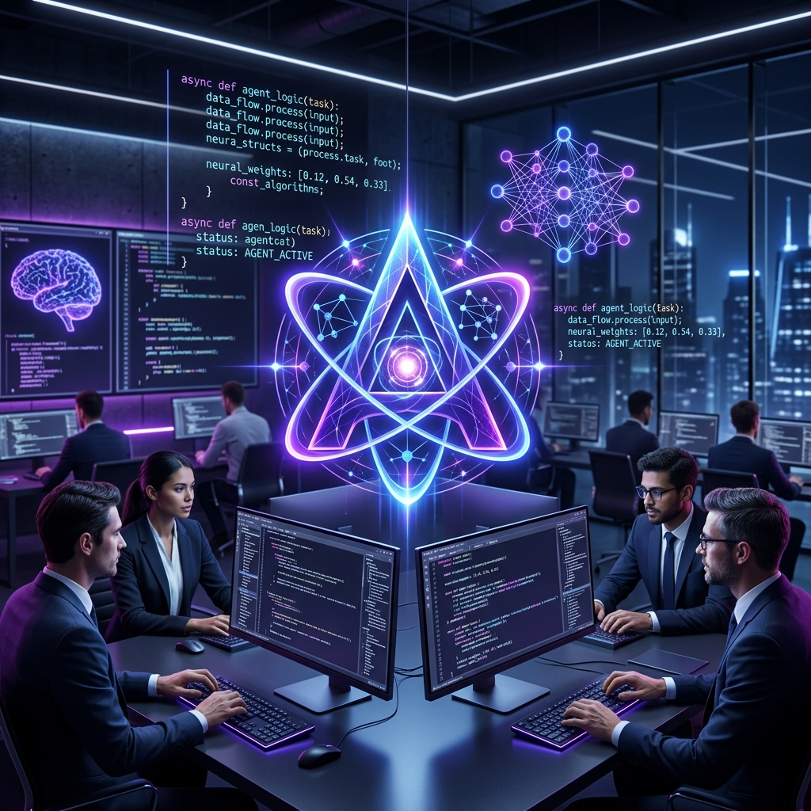

# 🚀 Agentic Developer Workshop

## 🌟 Overview

This workshop is a high-intensity, hands-on immersion into the future of software engineering. Rather than teaching you "how to code," we focus on **"how to architect, debug, and evolve"** systems using agentic AI.

We have replaced traditional, linear codelabs with a **"Day-in-the-Life"** simulation. You aren't just following instructions; you are pair-programming with a world-class AI agent to solve real-world engineering challenges.

---

## 🎯 Why This Format Matters

Most AI tutorials focus on "Hello World" or greenfield generation. In reality, **90% of developer work is maintenance, debugging, and iteration.**

Our format matters because:

- **Ambiguity-First**: We provide code with intentional bugs, security holes, and performance bottlenecks. You must learn to *diagnose* using the agent, not just generate snippets.
- **Context-Driven**: You will learn the most critical skill in AI-assisted development: **Context Management**. Whether it's using the `@` operator in the CLI or implementation plans in the IDE, you'll master how to feed the right information into the model.
- **Dual-Track Learning**: By offering both **Antigravity (Visual IDE)** and **Gemini CLI (Terminal)**, we show that agentic development isn't tied to a single tool—it's a mindset that moves with you across your entire stack.

---

## 🛠️ How This Workshop Helps

By the end of these 10 projects, you will:

1. **Reduce "To-Do" Friction**: Learn to use AI to handle the "boring" parts (documentation, boilerplate tests, migrations).
2. **Master Iterative Prompting**: Move beyond one-shot prompts. You'll learn how to "direct" an agent through complex refactors.
3. **Bridge the DevOps Gap**: Use agents to generate infrastructure-as-code and CI/CD pipelines, lowering the barrier to production.
4. **Harden Your Code**: Use AI as an automated security auditor to find and fix common vulnerabilities like SQLi and XSS.

---

## 👥 Who Will Benefit?

- **Individual Developers**: Looking to double their productivity and focus on high-level architecture.
- **Tech Leads & Architects**: Seeking to understand how agentic workflows can standardize code quality and documentation across teams.
- **DevOps Engineers**: Interested in how AI can simplify containerization and deployment automation.
- **AI Enthusiasts**: Anyone eager to see the "pro-level" application of LLMs in a complex, multi-layered environment.

---

## ⚡ The 10-Project Journey

1. **Vibe-Coding**: Pure creativity and rapid prototyping.
2. **Documentation**: Knowledge extraction from complex logic.
3. **Feature-Building**: Modifying existing stateful applications.
4. **Refactoring**: Improving code health and readability.
5. **Testing**: Ensuring reliability through automation.
6. **Migration**: Modernizing legacy patterns.
7. **Bug-Fixing**: Troubleshooting the Inventory & Discount API logic.
8. **Security**: Hardening apps against modern exploits.
9. **Performance**: Diagnosing and fixing algorithmic bottlenecks.
10. **Deployment**: Shipping your code to the world.

---

> [!TIP]
> **Don't just fix the code. Ask the agent *why* it chose a specific solution.** The goal of this workshop is to build intuition for agentic collaboration, making you 10x more effective in your daily workflow.
